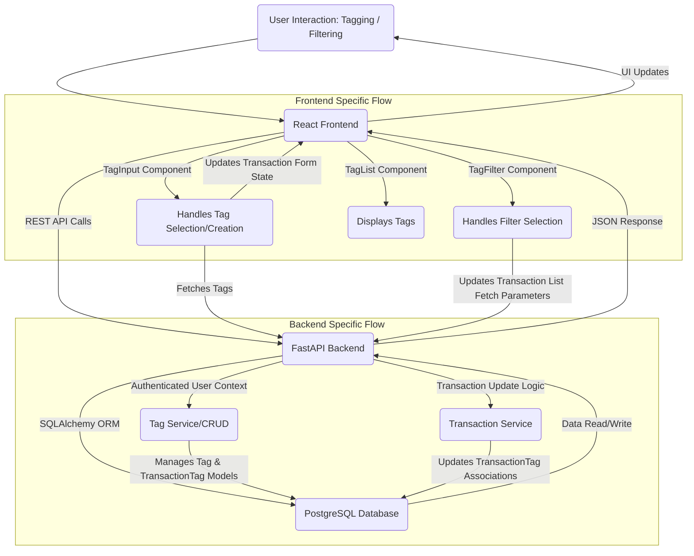

# Solution Architecture: Transaction Tagging System

## 1. Overview
This document outlines the technical solution for implementing a **Custom Tagging System** for transactions within the Budget application, building upon the requirements defined in the PRD and UX Specification. The goal is to provide users with flexible, searchable, and intuitive ways to organize their financial data using custom tags.

## 2. Existing System Context
-   **Backend:** Python FastAPI framework, using SQLAlchemy as ORM for database interactions.
-   **Frontend:** React 19 application, built with Vite, styled with Bootstrap 5 and React-Bootstrap components.
-   **Database:** PostgreSQL, managed with Alembic for schema migrations.
-   **Integration:** Existing integration with SimpleFin Bridge for transaction synchronization.

## 3. New Components and Modules

### 3.1 Backend (`finance-app/`)
-   **Database Models:**
    -   `Tag` Model: A new SQLAlchemy model to represent a user-defined tag.
        -   Fields: `id` (PK), `user_id` (FK to `users.id`), `name` (unique per user), `color` (optional, for UI presentation).
    -   `TransactionTag` Association Model: A new SQLAlchemy association model to establish a many-to-many relationship between `Transaction` and `Tag` models.
        -   Fields: `transaction_id` (FK), `tag_id` (FK).
-   **API Endpoints:**
    -   Dedicated CRUD endpoints for `Tag` resources (`/tags`).
    -   Modification of the `Transaction` update endpoint (`PATCH /transactions/{id}`) to accept and manage associated tags.
-   **Service Layer:**
    -   New service functions or updates to existing `crud.py` to handle `Tag` creation, retrieval, update, and deletion.
    -   Logic to associate/disassociate `Tag` objects with `Transaction` objects, ensuring user ownership.

### 3.2 Frontend (`frontend/`)
-   **Custom Components:**
    -   `TagInput` Component: A reusable React component that combines a text input with tag suggestion/selection dropdown and dynamic tag creation. It will display selected tags as Bootstrap pills.
    -   `TagList` Component: A presentational React component to render an array of tags (as Bootstrap pills) associated with a transaction.
    -   `TagFilter` Component: A React component for the transaction list filter bar, enabling users to select multiple tags to filter transactions.
-   **View Integration:**
    -   Transaction Detail/Edit View: Integrate the `TagInput` component to allow users to assign tags to a specific transaction.
    -   Transaction List View: Update transaction rows to display associated tags using the `TagList` component. Integrate the `TagFilter` component into the existing filter bar.

## 4. Database Schema Changes

```sql
-- New Tag table
CREATE TABLE tags (
    id SERIAL PRIMARY KEY,
    user_id INTEGER NOT NULL REFERENCES users(id) ON DELETE CASCADE,
    name VARCHAR(255) NOT NULL,
    color VARCHAR(7) DEFAULT '#6c757d', -- Bootstrap secondary color as default
    created_at TIMESTAMP WITH TIME ZONE DEFAULT NOW()
);
CREATE UNIQUE INDEX uq_user_tag_name ON tags (user_id, name);

-- New Association Table for Transaction and Tags (Many-to-Many)
CREATE TABLE transaction_tags (
    transaction_id INTEGER NOT NULL REFERENCES transactions(id) ON DELETE CASCADE,
    tag_id INTEGER NOT NULL REFERENCES tags(id) ON DELETE CASCADE,
    PRIMARY KEY (transaction_id, tag_id)
);
```
-   These schema changes will be managed via **Alembic migrations**.

## 5. API Endpoints

### 5.1 Tags Management (`/tags`)
-   `GET /tags`: Retrieve all tags owned by the authenticated user.
    -   Response: `List[TagSchema]`
-   `POST /tags`: Create a new tag for the authenticated user.
    -   Request: `TagCreateSchema` (e.g., `name: str`, `color: Optional[str]`)
    -   Response: `TagSchema`
-   `PUT /tags/{tag_id}`: Update an existing tag owned by the user.
    -   Request: `TagUpdateSchema`
    -   Response: `TagSchema`
-   `DELETE /tags/{tag_id}`: Delete a tag owned by the user.
    -   Response: `{"message": "Tag deleted successfully"}`

### 5.2 Transaction Tagging (`PATCH /transactions/{id}`)
-   **Purpose:** Modify an existing transaction, including its associated tags.
-   **Request Payload:** The existing `TransactionUpdateSchema` will be extended to optionally accept `tag_ids: List[int]`. This list will represent the *complete set* of tags to be associated with the transaction, effectively replacing any previous associations.
-   **Backend Logic:**
    1.  Fetch the transaction and verify user ownership.
    2.  Validate `tag_ids` to ensure they refer to valid tags owned by the same user.
    3.  Delete all existing entries for `transaction_id` in `transaction_tags`.
    4.  Create new entries in `transaction_tags` for each `tag_id` provided.
    5.  Return the updated `TransactionSchema` including its associated tags.

## 6. Frontend Integration Points

-   **Transaction Detail/Edit Form (`frontend/src/pages/Transactions.tsx` or similar):**
    -   A `TagInput` component will be rendered. It will fetch available tags via `GET /tags` and display assigned tags for the current transaction.
    -   When saving the transaction, the list of associated `tag_ids` from the `TagInput` will be sent in the `PATCH /transactions/{id}` request.
-   **Transaction List Rows (`frontend/src/components/TransactionList.tsx` or similar):**
    -   Each `Transaction` row will include the `TagList` component to visually display its associated tags as Bootstrap `pill` badges.
-   **Global Filter Bar (`frontend/src/components/FilterBar.tsx` or similar):**
    -   A `TagFilter` component will be added, allowing users to select multiple tags. This will modify the API request parameters for fetching transactions (e.g., `GET /transactions?tags=1,2,3`).

## 7. Data Flow



## 8. Security Considerations

-   **User Authorization:** All tag and transaction operations (CRUD, association) must enforce strict `user_id` based authorization to ensure users can only access/modify their own data.
-   **Input Validation:** Implement robust server-side validation for tag names (length, characters, uniqueness per user) to prevent malformed data or injection attacks.
-   **Data Integrity:** Foreign key constraints and CASCADE delete options will maintain referential integrity in the database.

## 9. Deployment and Scalability

-   **Alembic Migrations:** The new `tags` and `transaction_tags` tables will be introduced via Alembic migration scripts.
-   **API Performance:** New `/tags` endpoints are expected to have low to moderate traffic. The `PATCH /transactions/{id}` endpoint will involve additional database operations (delete existing `transaction_tags`, insert new ones), which should be batched/optimized for performance.
-   **Database Load:** Indexing on `uq_user_tag_name` and the `PRIMARY KEY (transaction_id, tag_id)` for `transaction_tags` will be crucial for efficient lookups and joins when filtering.
-   **Frontend Bundle Size:** The new React components will incrementally increase the frontend bundle size, but this impact is expected to be minimal.
-   **Scalability:** The chosen database schema and API design are horizontally scalable for typical personal finance usage.

---

**Architect Agent:** Shall I save this Solution Architecture to `docs/architecture-solution.md`?