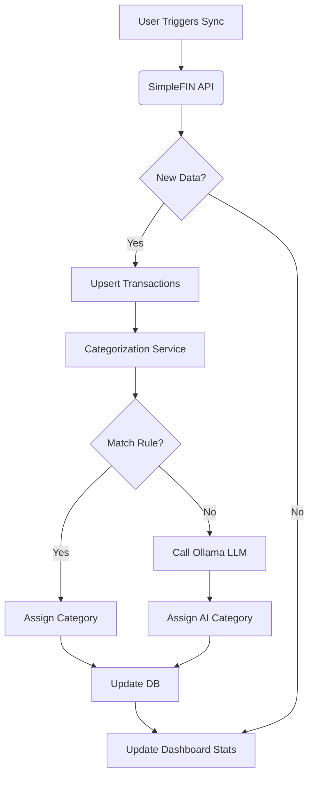

# Product Requirement Document (PRD): Budget Flow & PWA Transformation

**Status:** Draft
**Author:** BMAD Analyst & PM Agent
**Date:** 2025-12-16
**Target Component:** Full Stack (Frontend PWA + Backend Services)

## 1. Executive Summary
This PRD defines the requirements for two major initiatives:
1.  **Budget Intelligence Flow:** Implementing a robust data pipeline that ingests financial data via specific workflows (SimpleFIN), validates it, and automatically categorizes transactions using a hybrid Rule-Based + LLM approach.
2.  **PWA Transformation:** Converting the existing React frontend into a Progressive Web App (PWA) to ensure a "native-app-like" experience on mobile devices, offline capabilities, and installability.

## 2. Problem Statement
*   **Mobile Experience:** Users currently access the application via a browser, which feels disjointed on mobile devices. There is no offline access or "app-icon" entry point.
*   **Data Overload:** Raw transactions from SimpleFIN are often cryptic. Without robust categorization, users cannot see where their money is going (Budgeting).
*   **Workflow Gaps:** The current codebase has disconnected scripts for fetching data and categorization (notebooks). These need to be integrated into a seamless, automated application flow.

## 3. Goals & Objectives
*   **Mobile-First PWA:** Achieve 100% PWA compliance (Manifest, Service Worker, HTTPS) to allow "Add to Home Screen".
*   **Automated Budget Flow:**
    *   **Ingest:** Reliability fetch data from SimpleFIN (Account Aggregation).
    *   **Process:** Normalize and store data.
    *   **Categorize:** Apply user-defined Rules first, then fallback to Local AI (Ollama) for uncategorized items.
*   **User Engagement:** "Wow" the user with a responsive, premium UI that feels alive (animations, glassmorphism).

## 4. User Stories

| ID | As a... | I want to... | So that... |
| :--- | :--- | :--- | :--- |
| **US-PWA-1** | Mobile User | Install the app on my phone home screen | I can access my budget quickly without opening a browser tab. |
| **US-PWA-2** | User | Access the app even with flaky internet | I can view my cached balances/transactions offline. |
| **US-DATA-1** | User | Have my transaction for "Hydro" automatically marked "Utilities" | I don't have to manually edit recurring bills. |
| **US-DATA-2** | User | Have "Unknown" transactions intelligently guessed by AI | I spend less time managing data and more time analyzing it. |
| **US-DATA-3** | User | Manually label an "Unknown" transaction and have the system remember it | Next time I shop there, it is categorized automatically without my intervention. |
| **US-FLOW-1** | System | Automatically run categorization after a sync | The dashboard always shows categorized data immediately. |

## 5. Functional Requirements

### 5.1 Progressive Web App (PWA)
*   **Manifest:** Must include `manifest.json` with appropriate icons (192x192, 512x512), `start_url`, `display: standalone`, and `theme_color`.
*   **Service Worker:** Implement a Service Worker (via `vite-plugin-pwa`) to cache static assets (HTML, CSS, JS) and API responses for core routes (`/dashboard`, `/transactions`).
*   **Install Prompt:** Creating a UI element (IOS/Android specific instructions) to guide users to install the app.
*   **Responsiveness:** All pages must be fully responsive. No horizontal scrolling on mobile. Touch targets must be >44px.

### 5.2 Budget Data Flow Logic
This flow replaces the standalone scripts (`simplefin.ipynb`, `categorize_transactions.ipynb`) with an integrated application pipeline.

#### Step 1: Ingestion (SimpleFIN)
*   *Ref:* `docs/prd-simplefin-integration.md`
*   Fetch Accounts and Transactions.
*   Normalize Data (Date parsing, currency handling).
*   Upsert to Database (`transactions` table).

#### Step 2: Hybrid Categorization Engine
The system MUST implement a service that processes transactions with `category: NULL` or `category: "Uncategorized"`.

**A. Rule-Based Phase (High Priority)**
*   The system checks a defined list of Rules (`CATEGORY_RULES` from notebook).
*   **Logic:**
    *   **OR:** If *any* keyword matches -> Assign Category.
    *   **AND:** If *all* keywords match -> Assign Category.
*   *Performance:* This runs in-memory and is instant.

**B. AI-Based Phase (Fallback)**
*   If no Rule matches, send `description` and `amount` to the LLM Provider (Ollama).
*   **Prompt Engineering:** Use the specific prompt structure defined in `categorize_transactions.ipynb` to ensure consistent output.
*   **Validation:** Verify the output matches a valid `Category` from the master list. If invalid, default to "**Unknown**".

#### Step 3: User Feedback Loop (Learning)
*   **Manual Override:** Allow users to manually assign a category to any transaction (especially those marked "Unknown" or incorrectly categorized).
*   **Rule Generation:** When a user manually updates a category, the system MUST ask (or offer as a checkbox): *"Always apply this category to {Description}?"*
*   **Action:** If confirmed, the system creates a new **Rule** in the database with:
    *   `keyword`: A meaningful substring of the transaction description (e.g., "Starbucks").
    *   `category`: The selected category (e.g., "Coffee").
    *   `logic`: "OR" (default).
    *   `priority`: High (User rules override system defaults).

#### Step 4: Aggregation
*   Update Account Balances.
*   Recalculate "Spent by Category" metrics for the Dashboard.

## 6. Technical Specifications

### 6.1 Frontend Architecture (`frontend/`)
*   **Framework:** React + Vite.
*   **PWA Library:** `vite-plugin-pwa`.
*   **Styling:** Tailwind CSS (continuing the existing design system).
*   **Components:**
    *   `InstallPWA.tsx`: Component to prompt installation.
    *   `SyncStatus.tsx`: Visual indicator of the sync/categorization process.

### 6.2 Backend Architecture (`finance-app/`)
*   **New Services:**
    *   `app/services/categorization.py`:
        *   `class CategorizationService`: Encapsulates Rules and Ollama Logic.
        *   `apply_rules(transaction)`: Returns category or None.
        *   `predict_category(transaction)`: Calls Ollama.
        *   `learn_rule(transaction_description, new_category)`: Generates and saves a new rule associated with this pattern.
*   **Workflow Integration:**
    *   Modify `app/routers/sync.py`: After `fetch_data()` completes, automatically trigger `categorize_transactions()`.
    *   **New Endpoint:** `POST /transactions/{id}/categorize`: Updates category and optionally creates a Rule.

### 6.3 Data Model Updates
*   **Transactions Table:** Ensure `category` column exists and is indexed for performance.
*   **Rules Table:** Create a new table `categorization_rules` to store persistent rules.
    *   Columns: `id`, `user_id` (if multi-user), `keyword`, `category`, `match_logic` (AND/OR), `created_at`.
    *   Seed: Populate initially with the static list from `categorization_transactions.ipynb`.

## 7. Workflow Diagram (Conceptual)

## 8. Implementation Plan

### Phase 1: PWA Foundation
1.  Configure `vite-plugin-pwa`.
2.  Generate Icons and Manifest.
3.  Test "Install" flow on mobile simulators.

### Phase 2: Categorization Migration
1.  Port `CATEGORY_RULES` and logic from `categorize_transactions.ipynb` to `app/services/categorization.py`.
2.  Implement the Ollama client wrapper in `app/core/llm.py`.
3.  Create an endpoint `POST /transactions/categorize` to trigger the process manually or automatically.

### Phase 3: UI Integration
1.  Update Transaction List to show Categories.
2.  Add "Sync & Organize" button that runs the full pipeline.
